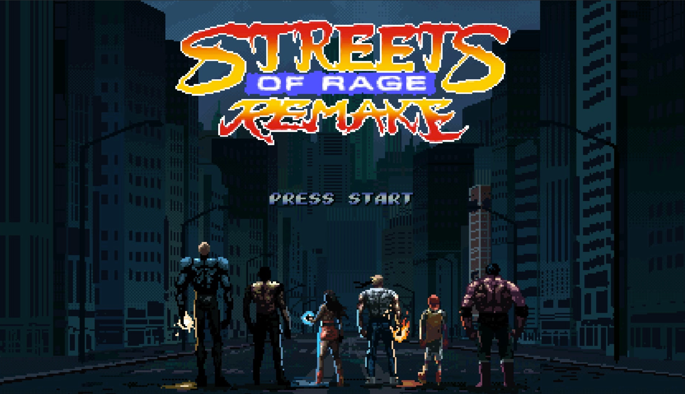
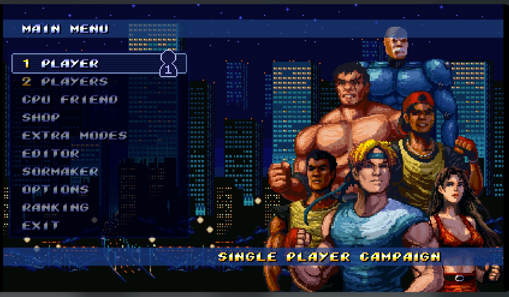
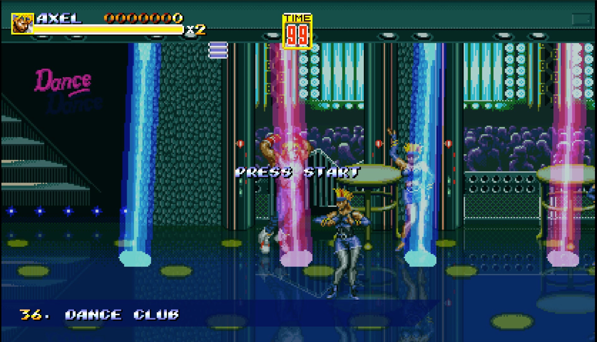
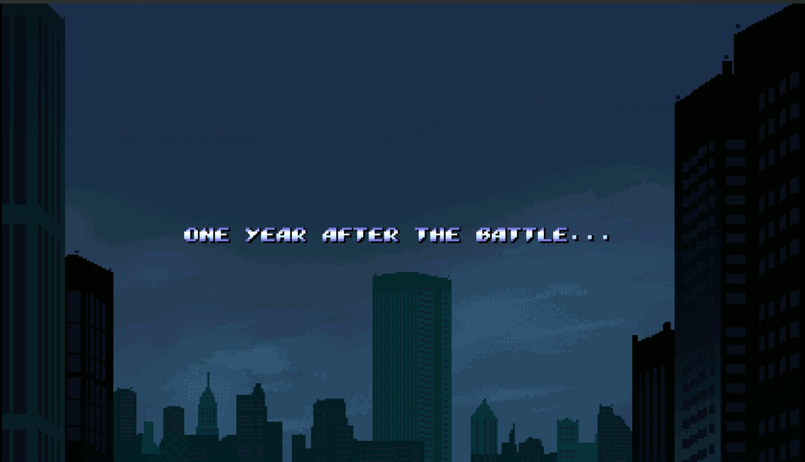

# BennuGD for MiSTer



Streets of Rage Remake 5.2 on a MiSTer. The FPGA carries the video, audio
and controller plumbing; the DE10-Nano's ARM side runs the BennuGD
interpreter that the game was written for. It is one core, and any BennuGD
1.x game can ride on it, but SorR is the one that has been tested.

**Status: alpha.** It is generally playable: correct colours, vsynced
video without tearing, pads mapped in the MiSTer OSD, steady sound through
level transitions, saves working. Much remains to be tested. The heaviest
scenes still run below 60 fps because the interpreter is out of CPU there,
only one pad has been tried, only HDMI output has been checked, and other
BennuGD games have not been tried at all. Expect rough edges and please
report what you find.

|  |  |  |
|:--:|:--:|:--:|
| Main menu | Stage 36, Dance Club | Intro |

All captures are from the MiSTer over HDMI, through a capture card.

## Installing Streets of Rage Remake 5.2

You need a MiSTer updated during 2026 (the launch mechanism relies on a
Main_MiSTer from this year), a display on the HDMI port (the picture goes
through the MiSTer scaler; analog output is not supported yet), a way to
put files on the SD card (the network share or a card reader), and your
own copy of Streets of Rage Remake 5.2. Nothing from the game ships with
this core.

**1. Get the game onto the card.** On a PC, SorR 5.2 is a folder with
`SorR.exe`, `SorR.dat`, `mod`, `palettes` and `savegame` in it. Create
this folder on the card and copy these into it, exactly these names:

```
/media/fat/games/BennuGD/SORRv52/SorR.dat
/media/fat/games/BennuGD/SORRv52/mod/         (whole folder)
/media/fat/games/BennuGD/SORRv52/palettes/    (whole folder)
/media/fat/games/BennuGD/SORRv52/savegame/    (whole folder, may be empty)
```

Leave the `.exe` and `.dll` files behind, they are Windows only. The
folder name `SORRv52` and the file name `SorR.dat` matter: the menu entry
points at them.

This is the file that was tested. Check yours before going further; a
different version or a modded `.dat` is untested here:

| file | size | CRC32 | MD5 |
|---|---|---|---|
| `SorR.dat` (v5.2) | 320,091,685 bytes | `1b1d6221` | `bce446c9c5bd86cc345a01917967e404` |

On the MiSTer over ssh: `md5sum /media/fat/games/BennuGD/SORRv52/SorR.dat`.
On a PC, any checksum tool will do (7-Zip's CRC option, or `certutil
-hashfile SorR.dat MD5` on Windows).

**2. Set the game's display mode.** Open
`/media/fat/games/BennuGD/SORRv52/mod/system.txt` in a text editor. Under
the line `// FULL SCREEN WIDE: AUTO, DESKTOP, BORDERLESS, BORDERLESS_SYNC`
make sure the value is

```
BORDERLESS_SYNC
```

This is the mode that renders at the game's native size. The others make
the game upscale in software, which the ARM cannot afford.

**3. Unpack the release.** Download `BennuGD_MiSTer_alpha_<date>.zip (the newest one)` from
the Releases page and unzip it onto the root of the SD card. It creates:

```
/media/fat/bennugd/                     the ARM side and its installer
/media/fat/_Other/_BennuGD/             the core (.rbf) and the game entry (.mgl)
/media/fat/Scripts/BennuGD_install.sh   one-time setup, run from the OSD
```

**4. Run the setup script once.** On the MiSTer, open the OSD, go to
Scripts, and run `BennuGD_install`. It adds a `[BennuGD]` section to
MiSTer.ini, registers the small launcher daemon in
`/media/fat/linux/user-startup.sh`, and starts it. Nothing else on the
card is touched. (If you prefer ssh: `sh /media/fat/bennugd/install.sh`.)

**5. Play.** In the MiSTer menu go to Other, then BennuGD, then
SoRR 5.2. The game takes a few seconds to load. Press F12 or the menu
button on the pad to open the OSD and map your pad under "define buttons"
(A B X Y L R Select Start). Inside the game's own options choose graphics
mode 1x / normal (the MiSTer scaler does the upscaling) and widescreen
as you like. Select+Start together on the pad, or End on a keyboard,
returns to the MiSTer menu. Loading another core from the OSD also stops
the game.

Saves go to the game's own `savegame` folder, as on a PC. Wait a moment
after a save before powering off; the card is flushed when the game
stops.

## Updating with update_all

The repository carries a `db.json.zip` for the MiSTer downloader. Add
this to `/media/fat/downloader.ini` and run Update All:

```
[rossops/bennugd_mister]
db_url = https://raw.githubusercontent.com/rossops/BennuGD_MiSTer/main/db.json.zip
```

It places the core, the game entries and the ARM side on the card, the
same files the release zip holds, and keeps them current. Your
`bennugd.cfg` is left alone. The downloader cannot edit MiSTer.ini or
`user-startup.sh`, so after the first update still run Scripts ->
BennuGD_install once (step 4). The game itself is never part of it.

## If something is wrong

**Black picture over HDMI, sound playing.** Your MiSTer.ini has
`direct_video=1` (used with HDMI-to-VGA DACs). Direct video bypasses the
scaler, and this core's picture lives in the scaler's framebuffer; its
own RGB output is black. The installer writes `direct_video=0` into the
`[BennuGD]` section of MiSTer.ini so the setting is overridden for this
core only; if you installed before that was added, add the line yourself
under `[BennuGD]`. Analog output through a DAC is not possible with this
core yet.

**Choppy sound, game running slowly.** First check the game's display
mode: look in `/media/fat/bennugd/bennugd.log` for a line `env: av info`.
It must say `416x240`. If it says `832x480` the game is upscaling in
software, which the ARM cannot keep up with; set `BORDERLESS_SYNC` in
`mod/system.txt` as in step 2 and restart. Also choose graphics mode
1x / normal in the game's own options. The heaviest scenes still drop
frames on the stock 800 MHz CPU; that is the known limit right now.

**Nothing starts when picking the game.** Check
`/media/fat/bennugd/launcherd.log`. The daemon must be running (the
setup script starts it, and `user-startup.sh` starts it at boot).

**Reporting a problem.** Attach `bennugd.log` and `launcherd.log` from
`/media/fat/bennugd/`, the `[MiSTer]` and `[BennuGD]` sections of your
MiSTer.ini, and the date of `/media/fat/MiSTer`. That is enough to tell
most things apart.

**Adding another BennuGD game** is a folder under `/media/fat/games/BennuGD/`
plus a copy of `SoRR 5.2.mgl` in `_Other/_BennuGD/` with the name and the
`path=` changed. Nothing about SorR is hard-coded, but nothing else has
been tried yet either.

## How it works

```
MiSTer menu: Other -> BennuGD -> SoRR 5.2 (.mgl)
   Main_MiSTer loads BennuGD.rbf, mounts the game's .dat and records its
   path; a small daemon on the Linux side sees the core name and starts
   /media/fat/bennugd/bennugd on that game.

ARM (Linux)                                    FPGA (Template_MiSTer + MISTER_FB)
bennugd: a tiny libretro host around           scans two RGB565 buffers in DDR3,
BennuGD_libretro, statically linked            flips them at vblank through a
  video  -> DDR3 via /dev/mem, page flip        64-byte control block that also
  audio  -> ALSA default (alsa.sv in the FPGA)  carries the OSD-mapped pads
  input  <- hps_io joystick words (control      to Linux; alsa.sv takes the
            block) or evdev when run from ssh   HPS audio; Menu-core timing
```

`docs/DESIGN.md` has the verified facts, the measurements and the dead
ends, in the order they happened.

## Building

ARM side, on a Mac or Linux box with zig 0.14.0 and cmake:

    hps/build.sh              # -> hps/out/bennugd

`releases/bennugd` is the committed copy of that binary for the downloader
database; `tools/make_db.py` rebuilds `db.json.zip` from it and the
release files. It applies the patches in `hps/patches/` to the BennuGD_libretro
submodule (an SDL shim fix, a scale fast path, a frame-rate cap, all
explained in the patch files). FPGA side, with Quartus 17.0 Lite:

    build.bat                 # -> releases/BennuGD_yyyymmdd.rbf

`sys/` is Template_MiSTer as shipped. Do not edit it; replace it wholesale.

## Credits

- **Bombergames** (Bomber Link and team) made Streets of Rage Remake, on
  Sega's Streets of Rage series. Get it from them; it is not distributed
  here.
- **SplinterGU** wrote BennuGD, the engine SorR runs on, out of Fenix.
- **diekleinekuh** wrote BennuGD_libretro, the wrapper this core links.
  Three small fixes found on the way live in `hps/patches/` and are
  meant to go back upstream.
- **Alexey Melnikov (sorgelig) and MiSTer-devel** made the MiSTer
  framework, Main_MiSTer and the Menu core this core is built from.
- **freemchr's 240mp-mister** and **kimchiman52's 3s-mister-arm** showed
  that a Linux program can be a MiSTer core, and how.
- zlib-ng, libpng, LibreSSL, libogg and libvorbis, and byuu's libco are
  bundled by the core.
- The code in this repository was written with Claude Code, measured on
  the hardware at every step, and steered by Ross Esposito.

GPL-2.0-or-later, like the framework and the engine.
